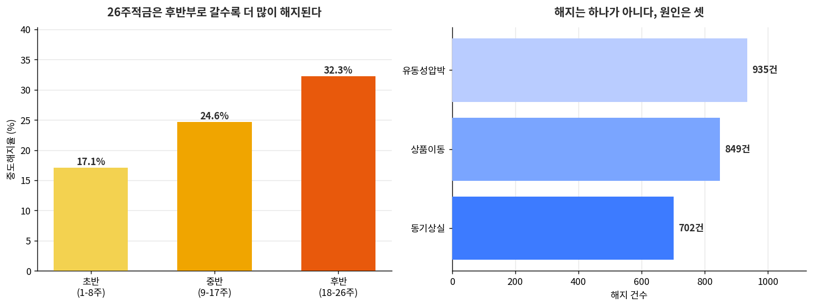
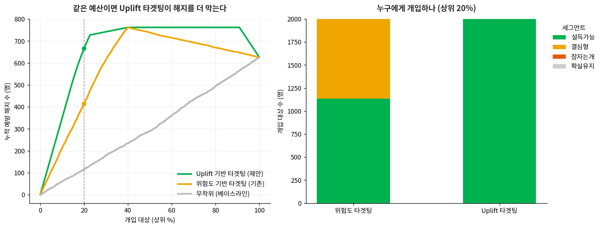

# 🌡️ 적금의 온도 (Saving Temperature)

> **AI로 26주적금의 '해지 온도'를 미리 읽고, 식기 전에 데우는 선제 리텐션 시스템**
>
> 카카오뱅크 AI Native 서비스 기획자 지원 포트폴리오 프로젝트

해지는 어느 날 갑자기 오지 않습니다. 서서히 식는 **상태**입니다.
그렇다면 온도처럼 **측정**할 수 있고, 식기 전에 **데울** 수 있습니다.

---

## 📌 핵심 성과

| 지표 | 결과 | 설명 |
|---|---|---|
| **해지 예측 정확도** | `AUC 0.779` | 11개 행동 신호 기반 RandomForest |
| **해지 예방 효율** | `+60% ↑` | 동일 예산 대비 예방 유저 극대화 (666 vs 414명) |
| **부작용 차단** | `15%p` | '잠자는 개' 세그먼트 사전 배제로 역효과 방지 |

> ※ 개인정보 없이 방법론을 증명하기 위해 **합성 데이터(1만 명)** 로 시뮬레이션했습니다.

---

## 🎯 문제 정의 (Why)

26주적금은 매주 납입액이 증가하는 구조상 **후반부로 갈수록 해지가 급증**합니다 (초반 17% → 후반 32%, 약 2배).
그런데 해지는 하나의 원인이 아니라 **유동성압박(38%)·상품이동(34%)·동기상실(28%)** 이 복합 작동합니다.

→ **원인을 구분하지 않은 일률적 팝업은 수신 방어에 실패**합니다.

---

## 🧩 접근 방식 (How)

행동 데이터 → ML 예측 → **Uplift 타겟팅** → 정책 엔진 → 원인별 UX

1. **예측 (1층)** — 관측 가능한 행동 신호만으로 해지 위험 예측 (데이터 누수 방지)
2. **원인 분해 (2층)** — 해지를 3가지 원인으로 분해해 맞춤 처방의 근거 확보
3. **Uplift 타겟팅 (3층)** — "해지할 사람"이 아니라 **"개입하면 마음이 바뀌는 사람"** 만 선별
   - 위험도 타겟팅의 함정: 예산의 43%를 '결심형(어차피 떠남)'에 낭비
   - 마케팅 인과추론의 **Uplift 곡선**을 리텐션에 적용
4. **정책 엔진** — 원인별 Trigger & Action 자동 배정
   - 유동성압박 → 부분출금 안내
   - 동기상실 → 쉬어가기 + 토닥 메시지
   - 상품이동 → 우대금리·저금통 연계

---

## 📊 주요 결과 시각화

| 문제 정의 | 개입 최적화 (Uplift) |
|---|---|
|  |  |

---

## 🗂️ 프로젝트 구조

```
saving-temperature/
├── saving_temperature.py   # 전체 파이프라인 (데이터 생성 → 예측 → Uplift → 정책)
├── requirements.txt
├── outputs/                # 결과 차트
└── README.md
```

## ▶️ 실행 방법

```bash
pip install -r requirements.txt
python saving_temperature.py
```

실행 시 데이터 1만 명을 생성하고, 예측 모델(AUC)·Uplift 성과·정책 배정 결과를 출력합니다.
`random_state=42`로 고정되어 있어 **누가 언제 돌려도 동일한 결과**가 재현됩니다.

## 🛠️ 기술 스택

`Python` · `scikit-learn` (RandomForest, LogisticRegression) · `pandas` · `numpy` · `matplotlib`

---

## 💡 프로젝트에서 배운 것

- **Data to Policy** — 모델 성능보다, 그 모델로 어떤 정책을 만들지가 더 중요하다.
- **User-Centric AI** — 차단보다 공감이, 유저의 완주율을 더 높인다.

> 데이터로 '무엇을, 언제, 누구에게' 할지 정하는 것 — 그것이 제가 생각하는 서비스 기획입니다.
